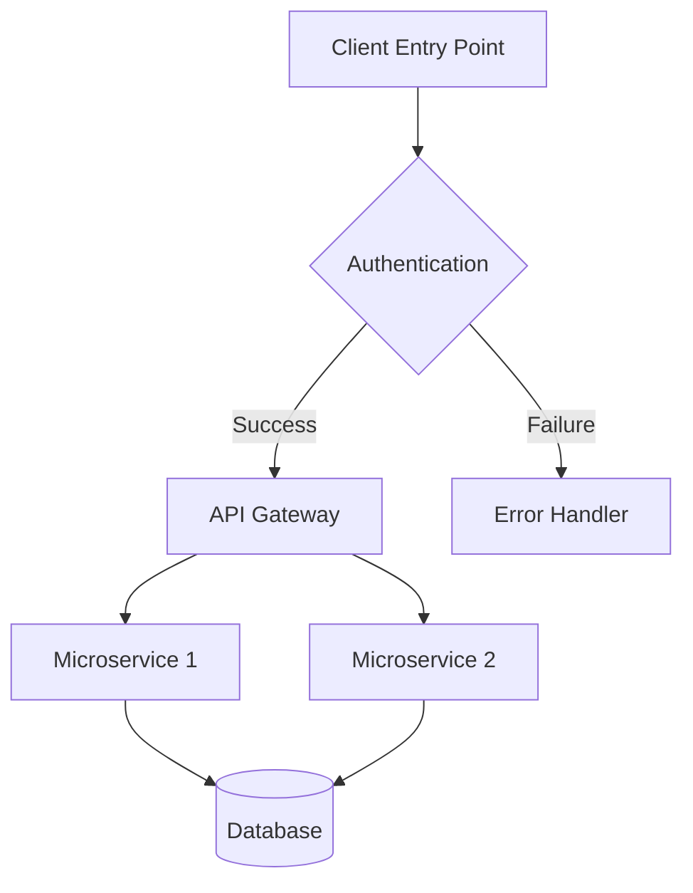
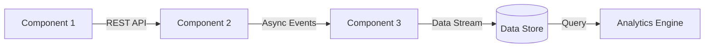
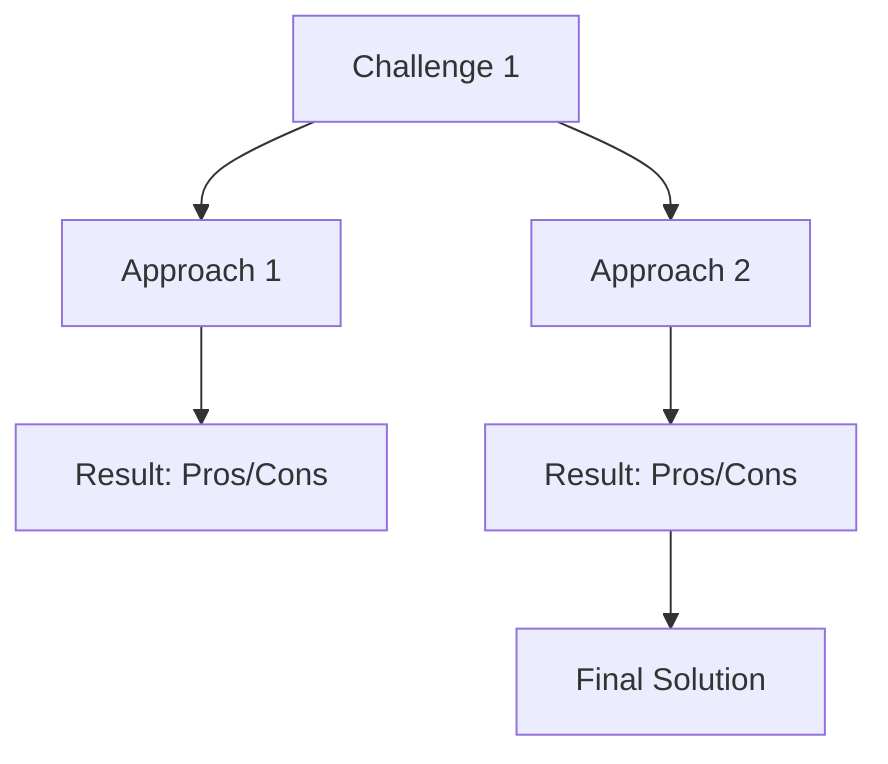
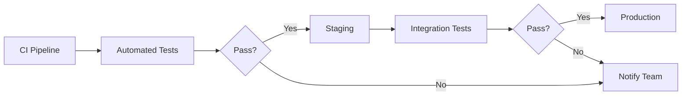

# Case Study: [Project Name]

## Executive Summary
Brief overview of the client, challenge, and solution (2-3 paragraphs)

## Business Challenge
- Technical context
- Pain points
- Limitations of existing solution

## Solution Architecture



## Technical Implementation

### Technology Stack
- Frontend: [List technologies]
- Backend: [List technologies] 
- Infrastructure: [List technologies]
- Testing: [List technologies]

### Key Technical Components



## Performance Metrics
| Metric | Before | After | Improvement |
|--------|--------|-------|-------------|
| Response Time | x ms | y ms | z% |
| Throughput | x req/s | y req/s | z% |
| Error Rate | x% | y% | z% |

## Technical Challenges & Solutions



## Code Example
```javascript
// Sample implementation code highlighting a key solution
function optimizedAlgorithm(data) {
  // Technical implementation details
  const result = complexProcessing(data);
  return result;
}
```

## Deployment Strategy



## Results & Business Impact
- Technical metrics achieved
- Business value delivered
- ROI statistics

## Lessons Learned
- Technical insights
- Architecture decisions that paid off/failed
- What we would do differently next time
